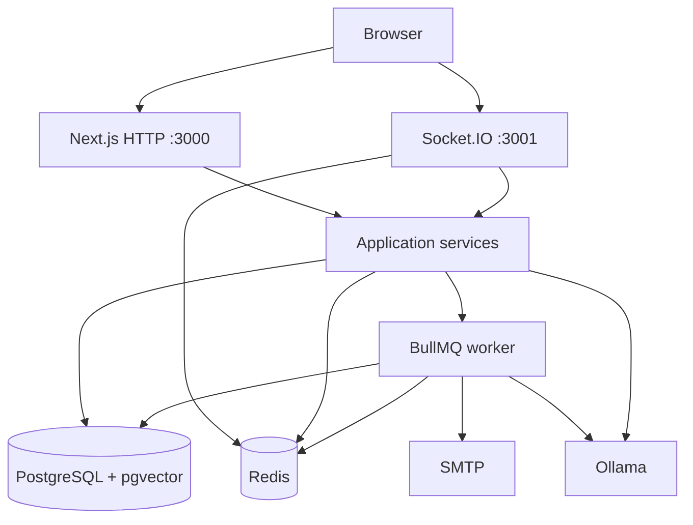

# Ticketloom Architecture

## Overview

Ticketloom is a **modular monolith**: Next.js HTTP app, BullMQ worker, and Socket.IO process, sharing PostgreSQL + Redis (+ optional Ollama).

```text
Browser
  ├── HTTP(S)  →  Next.js app (:3000)
  └── Socket.IO →  socket process (:3001)
           │
           ▼
     Auth.js + RBAC + domain services
           │
     ┌─────┼──────────┐
     ▼     ▼          ▼
 PostgreSQL Redis   BullMQ worker
 + pgvector           ├── SMTP
                      └── Ollama (AI / RAG)
```

```text
Repository layout
├── Next.js (UI + Route Handlers)
├── Worker — npm run worker
├── Socket — npm run socket
├── Prisma / PostgreSQL (+ pgvector)
├── Redis — cache, rate limits, BullMQ, Socket adapter
├── Ollama — optional local AI
├── Docker Compose — Redis (dev) + full stack (profile `full`)
└── Docs
```

## Milestone 1 status

Milestone 1 delivered the **UI foundation**.

## Milestone 2 status

Milestone 2 adds **real authentication**:

- Auth.js (Auth.js v5 / `next-auth`)
- PostgreSQL + Prisma
- Email/password signup + login + logout
- Google OAuth (optional)
- Organization + OWNER membership on signup
- Password reset + email verification architecture
- Protected routes via Next.js 16 `proxy.ts` + `requireUser()`

See [authentication.md](./authentication.md) and [database.md](./database.md).

## Milestone 3 status

Milestone 3 adds **organizations & RBAC**:

- Multi-organization membership
- Active organization switching
- Role → permission catalog (OWNER / ADMIN / AGENT / VIEWER)
- Server-side authorization helpers
- Members management (`/settings/members`)
- Secure invitations (`/invite/[token]`)
- Tenant isolation guarantees for future modules

See [multi-tenancy.md](./multi-tenancy.md).

## Milestone 4 status

Milestone 4 adds **ticketing / customer support core**:

- Organization-scoped tickets with human-friendly numbers (`TKT-000001`)
- Customers, teams, tags foundations
- Status / priority / assignment / archive
- Internal notes vs customer-visible replies
- Persisted activity timeline
- List search, filters, sort, pagination

See [ticketing.md](./ticketing.md).

## Milestone 5 status

Milestone 5 adds **Customer CRM**:

- Full customer profiles with status, tags, notes, and activity
- Search / filter / sort / pagination
- Archive/restore (preserves ticket history)
- Bidirectional ticket ↔ customer navigation
- Dashboard metrics backed by live ticket/customer counts

See [customers.md](./customers.md).

## Milestone 6 status

Milestone 6 adds **Redis caching & distributed rate limiting**:

- Central ioredis client (`REDIS_URL`)
- Cache-aside for dashboard / list metadata / org profile
- Tenant-safe `org:{organizationId}:…` keys + targeted invalidation
- Redis-backed rate limits for auth, invites, and search
- Health probes for Postgres + Redis

See [redis.md](./redis.md).

## Milestone 7 status

Milestone 7 adds **BullMQ workers**:

- Separate `npm run worker` process
- Email queue (invitation / reset / verification)
- Maintenance queue (invitation expiry + ticket SLA scan)
- Retries, delayed jobs, idempotent SLA markers
- Admin system health + queue observability

See [bullmq.md](./bullmq.md).

## Milestone 8 status

Milestone 8 adds **real-time support chat**:

- Socket.IO server (`npm run socket`) with Auth.js JWT auth
- Tenant-safe rooms + Redis adapter
- Persistent conversations/messages in PostgreSQL
- Ticket + customer integration
- Presence, typing, read receipts, unread counts

See [realtime-chat.md](./realtime-chat.md).

## Milestone 9 status

Milestone 9 adds the **enterprise Knowledge Base**:

- Organization-scoped bases, categories, tags, articles, versions
- Draft → review → publish → archive workflow with RBAC
- PostgreSQL full-text search
- Feedback, views, analytics
- Ticket + chat knowledge search entry points

See [knowledge-base.md](./knowledge-base.md).

## Target layered backend

```text
Route Handler / Socket handler
  → Controller / request handling
  → Service (business logic)
  → Repository (data access)
  → Prisma
  → PostgreSQL
```

## Application shell

```text
┌──────────────────────────────────────────┐
│ Sidebar │ Header                         │
│         ├────────────────────────────────┤
│         │ Page content                   │
└─────────┴────────────────────────────────┘
```

## Milestone 10–14 status

- **M10–M12**: AI assistance (Ollama/mock), RAG (pgvector), analytics
- **M13**: Security hardening (credential invalidation, invite limits, fail-closed email)
- **M14**: Docker packaging, env validation, CI, deployment docs

See [docker.md](./docker.md), [deployment.md](./deployment.md), [operations.md](./operations.md).

## Diagram — implemented runtime architecture



## Design decisions

See [architecture-decisions.md](./architecture-decisions.md).
